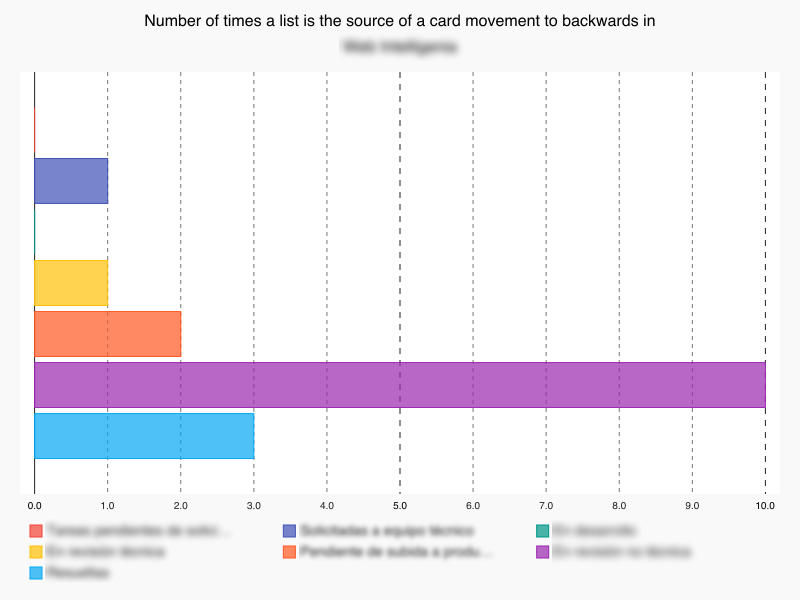
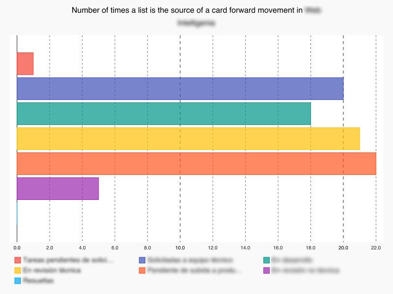

# pystats-trello

Statistics and charts for Trello boards.

These small utilities gives you the functionality needed to extract some metric from Trello Kanban boards.

# Requirements

See requirements.txt.


# Implemented Kanban Metrics

## Time by column

Average time the cards spend in each column.

Very useful to detect bottlenecks in your management process or project.

## Forward and backward movements per column

Number of forward movements and bacward movements that have a column as a source.

## Cycle

Time between development state and reaching "Done" state.

The average development and deployment time for all tasks of board.

## Lead time

Time from start to end ("Done" state).

Time a client has to wait to see a feature he/she asked.

## Time each card has been in each column

Based on movement operations, it is computed the time each card is in each column.

## Spent and estimated times for each card

Some plugins like Plus for Trello (http://www.plusfortrello.com/p/about.html)
allow the insertion of spent and estimated time values in the comments of each
card.

Specifying a regex in the settings_local allow the system to fetch them and
interpret them.

Please, note that we have supposed that if there are several comments with different
numbers, the numbers must be added. This is the case of Plus for Trello but your
case could be different.

# Installation

Create a virtualenv and install requirements.txt there.

Activate the **virtualenv** and follow next steps.


# Configuration

First you have to create a configuration file in the root of the project with the name **settings_local.py**.

This file will board preferences:

```txt

BOARD_NAME: <BOARD NAME>

DEVELOPMENT_LIST: <DEFAULT_DEVELOPMENT_LIST_NAME>

DONE_LIST: <DEFAULT_DONE_LIST_NAME>

CUSTOM_WORKFLOWS:
- <CUSTOM_WORKFLOW_1_NAME>
  - LISTS: <LIST_1A_NAME>, <LIST_1B_NAME>, ... <LIST_1Z_NAME>
  - DONE_LISTS: ... <LIST_1Z_NAME>
- <CUSTOM_WORKFLOW_2_NAME>
  - LISTS: <LIST_2A_NAME>, <LIST_2B_NAME>, ... <LIST_2Z_NAME>
  - DONE_LISTS: ... <LIST_2Z_NAME>

CARD_ACTION_FILTER: [YYYY-MM-DD, YYYY-MM-DD]

CARD_IS_ACTIVE_FUNCTION: <CARD IS ACTIVE CONDITION> (by default is not card.closed)

COMMENT_SPENT_ESTIMATED_TIME_REGEX: PLUS_FOR_TRELLO_REGEX

OUTPUT_DIR: <OUTPUT DIR>
```

## Configuration example

```txt
BOARD_NAME: My Tasks

DEVELOPMENT_LIST: Development

DONE_LIST: Done

CUSTOM_WORKFLOWS:
- Tasks waiting pass to deployment server
  - LISTS: Pending pass a deployment server
  - DONE_LISTS: Done

CARD_ACTION_FILTER: [2016-03-01, 2016-04-01]

CARD_IS_ACTIVE_FUNCTION: not card.closed

COMMENT_SPENT_ESTIMATED_TIME_REGEX: PLUS_FOR_TRELLO_REGEX

OUTPUT_DIR: ./results/my-tasks
```


# How to use it

```shell

python stats_extractor.py <configuration_file>
Where:
- <configuration_file> is the file path of the configuration file with your preferences.
```

returns a summary of stats of the board_name.

# Output

See output example file in [example result file](result-examples/results-for-board-example-datetime.txt).

## Card time by list chart


## Pushed back cards by list



## Moved forward cards by list




# Questions? Suggestions?

Don't hesitate to contact me, write me to diegojREMOVETHISromeroREMOVETHISlopez@REMOVETHISgmail.REMOVETHIScom.

(remove REMOVETHIS to see the real email address)