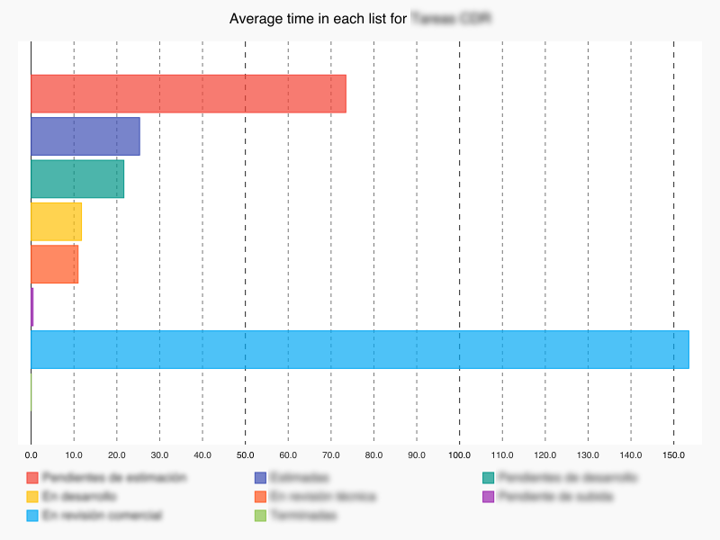

# pystats-trello

Statistics and charts for Trello boards.

These small utilities gives you the functionality needed to extract some metric from Trello Kanban boards.

# Requirements

See requirements.txt.


# Implemented Kanban Metrics

## Time by column

Average time the cards spend in each column.

Very useful to detect bottlenecks in your management process or project.

## Forward and backward movements per column

Number of forward movements and bacward movements that have a column as a source.

## Cycle

Time between development state and reaching "Done" state.

The average development and deployment time for all tasks of board.

## Lead time

Time from start to end ("Done" state).

Time a client has to wait to see a feature he/she asked.

## Time each card has been in each column

Based on movement operations, it is computed the time each card is in each column.

## Spent and estimated times for each card

Some plugins like Plus for Trello (http://www.plusfortrello.com/p/about.html)
allow the insertion of spent and estimated time values in the comments of each
card.

Specifying a regex in the settings_local allow the system to fetch them and
interpret them.

Please, note that we have supposed that if there are several comments with different
numbers, the numbers must be added. This is the case of Plus for Trello but your
case could be different.

# Installation

Create a virtualenv and install requirements.txt there.

Activate the **virtualenv** and follow next steps.


# Configuration

First you have to create a file in the root of the project with the name **settings_local.py**.

This file will contain authentication information and other global preferences for this project:

```python

# Trello authentication parameters, see https://trello.com/app-key for more information
TRELLO_API_KEY = "<trello api key>"
TRELLO_API_SECRET = "<trello api secret>"

TRELLO_TOKEN = "<trello token>"
TRELLO_TOKEN_SECRET = "<trello token secret>"

# This dict allows you to specify which of your columns is the "in development" column
# why is this needed? To compute cycle time.
DEVELOPMENT_LIST = {
    "_default": u"<default name of 'development' in your Kanban boards>",
    # You can specify different names for specific boards:
    "<board_1>": u"<board_1_in_development_name>",
    "<board_2>": u"<board_2_in_development_name>",
    # ...
    "<board_N>": u"<board_N_in_development_name>",
}

# This dict allows us to specify the "done" column. Optional.
# If this dict is not present it will suppose the last column is "done" column.
DONE_LIST = {
    "_default": u"<default name of 'done' list in your Kanban boards>",
    # You can specify different names for specific boards:
    "<board_1>": u"<board_1_done_list_name>",
    "<board_2>": u"<board_2_done_list_name>",
    # ...
    "<board_N>": u"<board_N_done_list_name>",
}

# The conditions to extract all the statistic information about a card is defined here.
# In this application jargon, cards that pass this test are called "active cards".
# This setting is optional and by default, cards that are not archived will be considered active.
CARD_IS_ACTIVE_FUNCTION = lambda c : not c.closed

# Some systems store the spent and estimated times of each task in the card comments.
# Setting this option allow the system to automatically fetch them.
# For example r"^plus!\s(?P<spent>(\-)?\d+(\.\d+)?)/(?P<estimated>(\-)?\d+(\.\d+)?)"
# is the regex for matching Plus for Trello (http://www.plusfortrello.com/p/about.html)
# comments
SPENT_ESTIMATED_TIME_CARD_COMMENT_REGEX = r"<regular expression used by plugin>"

# Output dir for the stats
OUTPUT_DIR = "<output>"

# If you want to use test.py set here the name of the board you want to query
TEST_BOARD = "<Name of the test board>"
```


# How to use it

```python

python stats_extractor.py <board_name>

```

returns a summary of stats of the board_name.

# Output

See output example file in [example result file](result-examples/results-for-board-example-datetime.txt).

This is the card time by list chart:



# Questions? Suggestions?

Don't hesitate to contact me, write me to diegojREMOVETHISromeroREMOVETHISlopez@REMOVETHISgmail.REMOVETHIScom.

(remove REMOVETHIS to see the real email address)